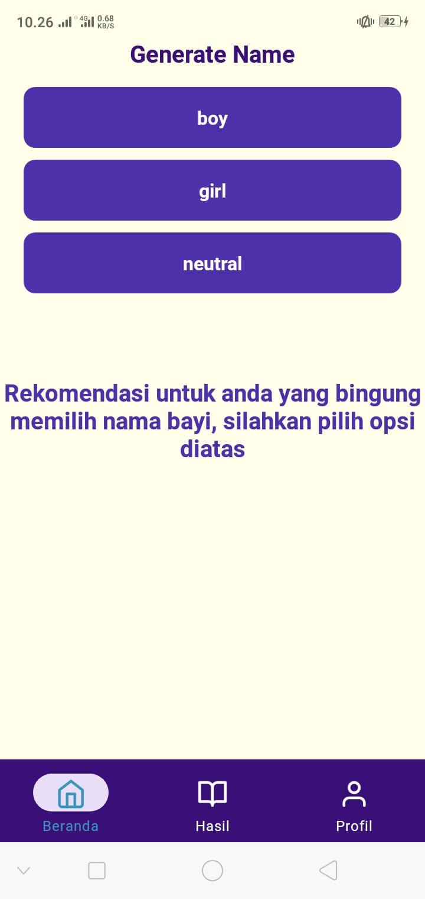
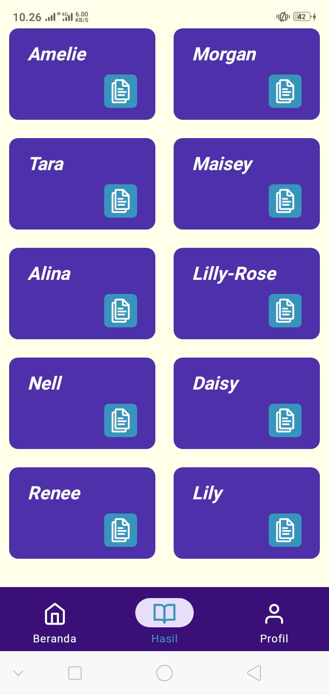

# Generate Name
Download aplikasi : <a href="https://expo.dev/artifacts/eas/hJq7wAvD2xiLNzahsenvmK.apk">Generate Name</a>

## Screenshoot
### Halaman Beranda


### Halaman Detail


### Halaman Profile


## Library
- React Native
- Expo
- Api Expo-Clipboard
- React Native Vector Icons
- React Navigation
- Api Ninjas

## Struktur Repo
```
/                   
├─ assets/         
│  └─ favicon.png
│  └─ icon.png
│  └─ adaptive-icon.png
│  └─ splash.png
├─ src/
├─ └─ components/
│     └─ tabnav.js  # Tab Navbar
│  └─ db/
│     └─ index.js   # data name
│  └─ pages/
│     └─ beranda.js # halaman utama
│     └─ hasil.js   # halaman hasil
│     └─ profile.js # halaman profile
|
├─ App.js           # file utama untuk merender semua file 
├─ .gitignore
├─ README.md
├─ app.json
├─ babel.config.json
├─ eas.json
├─ package-lock.json
├─ package.json
/                  
```

## Cara Menjalankan
- Clone Repository ini
- Masuk Kedalam directory utama dan jalankan
```
npm install
```
atau
```
npm install -f
```
- tunggu hingga proses selesai
- jalankan program dengan cara
```
npm run start
``` 
- pilih android atau web sesuai yang anda inginkan
